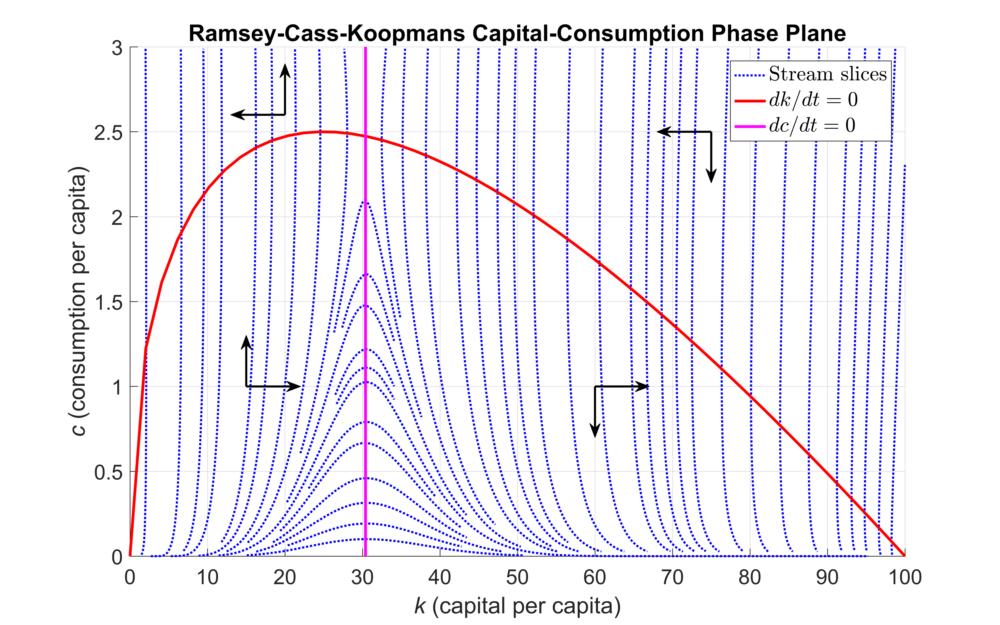

# Simulating the Ramsey-Cass-Koopmans Model Using MATLAB and Simulink

Many economic and financial models, such as those for resource allocation or optimal growth, involve systems of differential equations with no explicit analytical solution. Solving these systems numerically and visualizing results are important tasks for economists and other financial analysts.

Using the fundamental Ramsey-Cass-Koopmans (RCK) model as an example, this code, along with the corresponding [technical article](https://uk.mathworks.com/company/newsletters/articles/simulating-the-ramsey-cass-koopmans-model-using-matlab-and-simulink.html), describes two workflows for creating, simulating, and visualizing a system of ordinary differential equations (ODEs). One approach is based on MATLAB&reg;, the other on Simulink&reg;. The MATLAB approach uses programming techniques familiar to financial professionals who work in a technical computing environment. The Simulink approach offers a visual modeling environment and graphical representation of the system.

## Installation and Getting Started
The examples are provided in a MATLAB project.
1. Double-click on the project archive (`RCK.mlproj`) to extract it using MATLAB.
2. With MATLAB open, navigate to the newly-created project folder and double-click on the project file (`RCK.prj`) to open the project.
3. The example files are the live scripts within the project.
   - `createRCKModel.mlx`: This example shows how to define and solve the Ramsey-Cass-Koopmans model using MATLAB.
   - `createRCKModel.mlx`: This example shows how to define and solve the Ramsey-Cass-Koopmans model using MATLAB and the time elimination method to solve the system of ODEs.
   - `defineRCMParams.mlx`: This example contains the parameter definitions used in the Ramsey-Cass-Koopmans model. The parameters are stored in a structure for later reuse.
   - `parallelRCKMATLAB.mlx`: This example shows how to simulate the MATLAB version of the Ramsey-Cass-Koopmans model using parallel computing constructs to speed up the simulation process.
   - `parallelRCKSimulink.mlx`: This example shows how to simulate the Simulink version of the Ramsey-Cass-Koopmans model using parallel computing constructs to speed up the simulation process.
   - `plotPhasePortrait.mlx`: This example shows how to visualize the 2D phase plane corresponding to the system of ODEs defined by the Ramsey-Cass-Koopmans model.
   - `plotRCKSimulink.mlx`: This example shows how to simulate the Simulink version of the Ramsey-Cass-Koopmans model.

### [MathWorks&reg;](https://www.mathworks.com) Product Requirements

This example was updated using MATLAB release R2022b.
- [MATLAB&reg;](https://www.mathworks.com/products/matlab.html)
- [Simulink&reg;](https://www.mathworks.com/products/simulink.html)
- [Parallel Computing Toolbox&trade;](https://www.mathworks.com/products/parallel-computing.html)

## License
The licenses for this entry are available in the [license.txt](license.txt) and [license_ds2nfu.txt](license_ds2nfu.txt) files in this GitHub repository.

Copyright 2016-2023 The MathWorks, Inc.

## Community Support
[MATLAB Central](https://www.mathworks.com/matlabcentral)